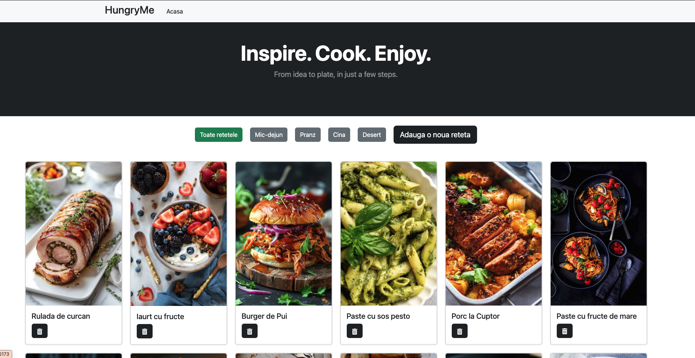
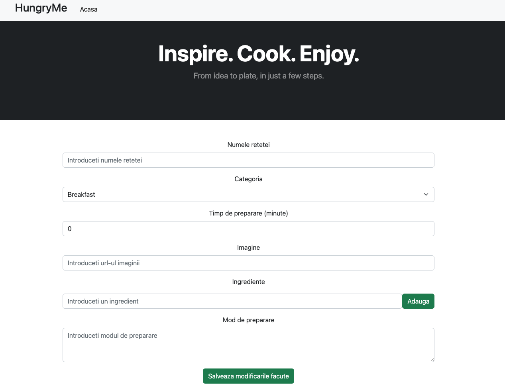
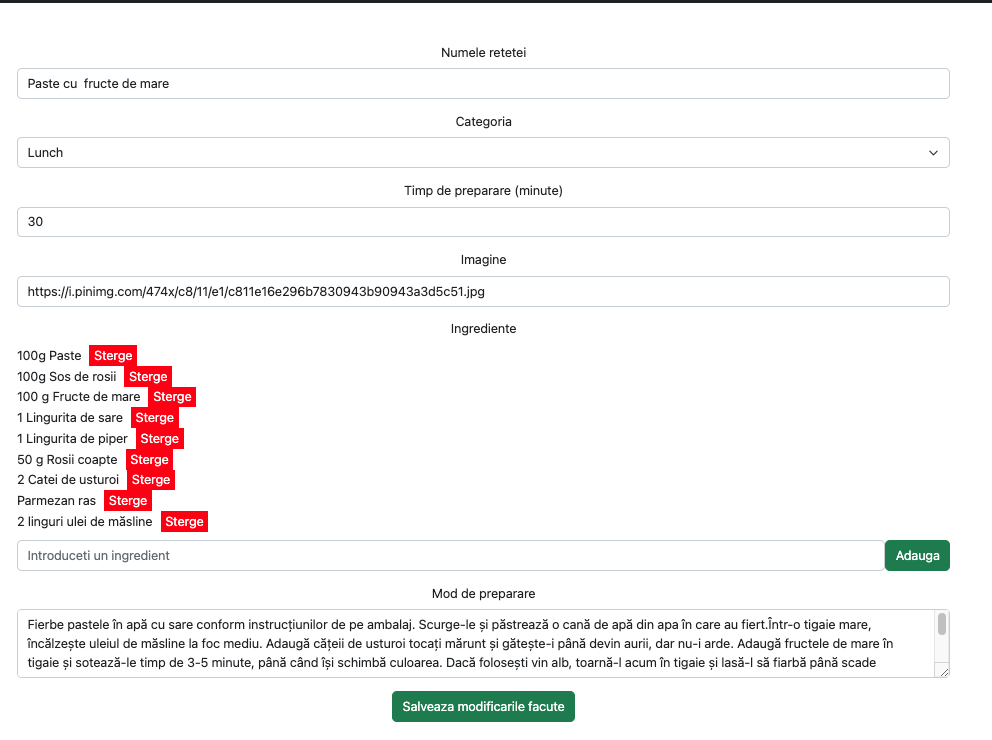
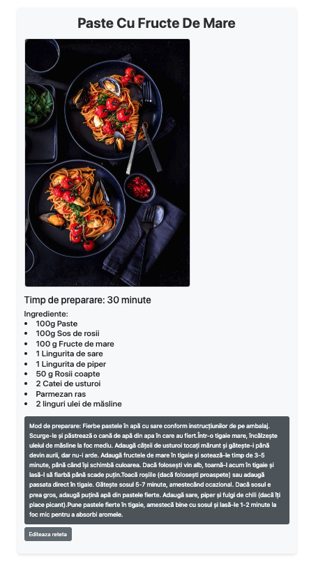
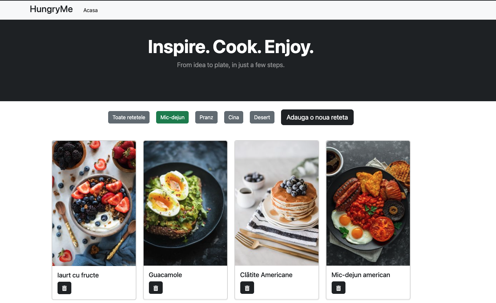
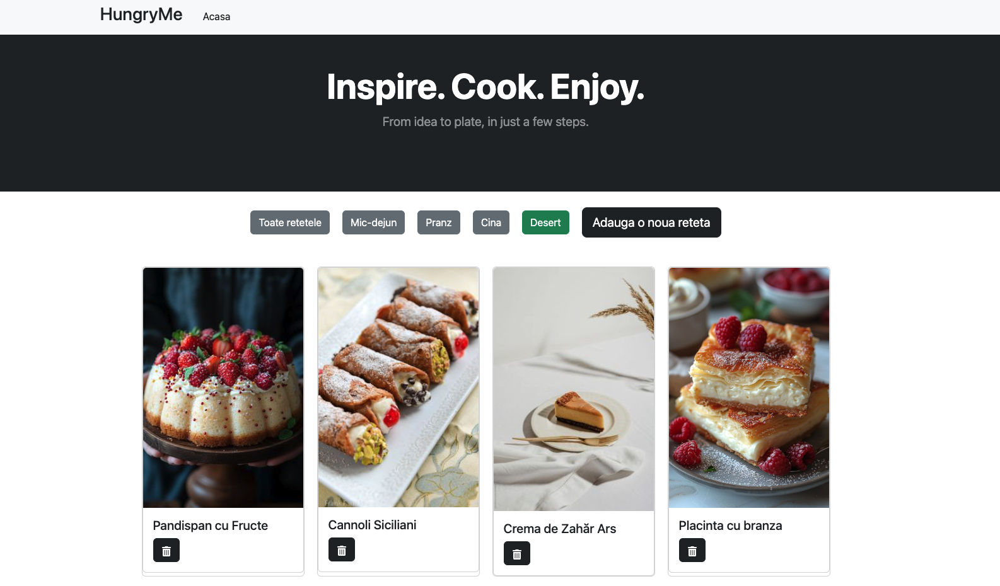
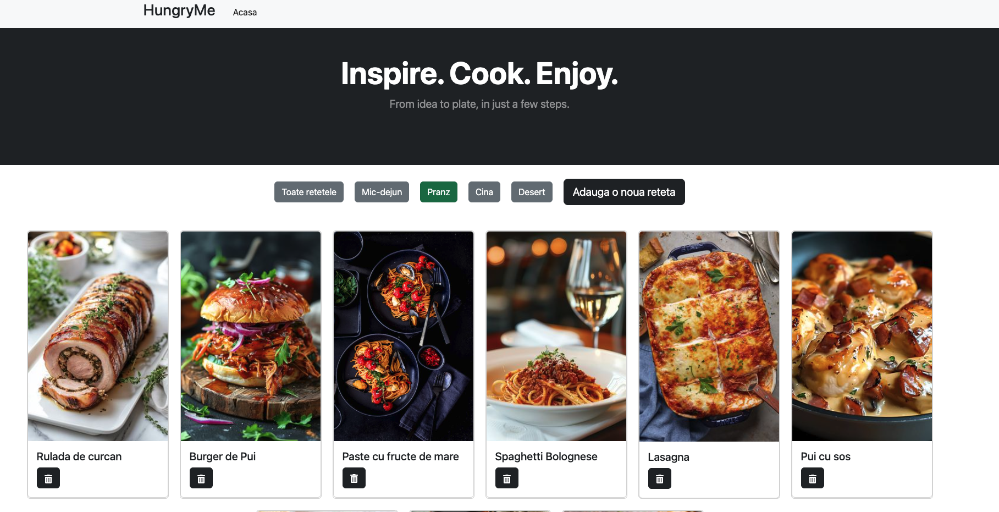

HungryMe - Recipe App
HungryMe is a recipe app where users can browse, add, edit, and delete recipes. The app allows users to filter recipes by categories like lunch, dinner, breakfast, and desserts. All data is stored in Firebase, and each recipe includes an image sourced from Pinterest, time needed for preparation the recipe, ingredients data and preparation.

Features:

1. Add New Recipes: Users can add new recipes through an intuitive form.
2. Browse Recipes: The home page displays a variety of recipes.
3. Category Filters: Filter recipes by categories like lunch, dinner, breakfast, and desserts.
4. Recipe Details: Click on a recipe image to view full details of the recipe.
5. Edit Recipes: Edit the details of an existing recipe.
6. Delete Recipes: Remove unwanted recipes by clicking the delete button.

Installation
To get the project running locally, follow these steps:

1. Clone the repository: git clone https://github.com/your-username/HungryMe.git
2. Navigate to the project folder: cd HungryMe
3. Install the dependencies: npm install
4. Set up Firebase:

- To connect the app to Firebase, you'll need to create a Firebase project and configure it for your application. Follow these steps:
- Go to the Firebase Console and create a new project.
- In the Firebase console, click on Firestore Database in the sidebar and create a new Firestore database.
- Create a collection named recipes. Each recipe document should have fields like title, ingredients, image, category, etc.
  Example structure of a recipe document:
  {"name" : "Spaghetti Carbonara",
  ingredients": ["spaghetti", "eggs", "cheese", "bacon"].
  "category": "lunch",
  "time" : 30,
  "image" : "image_URL",
  "preparation" : "..."
  }

- To connect your app to Firebase, go to Project Settings in the Firebase console, find your Firebase configuration, and copy the credentials (such as apiKey, authDomain, projectId, etc.).
- In your React project, create a .env file and paste the Firebase configuration values in the following format:

VITE_FIREBASE_API_KEY=your-api-key
VITE_FIREBASE_AUTH_DOMAIN=your-auth-domain
VITE_FIREBASE_PROJECT_ID=your-project-id
VITE_FIREBASE_STORAGE_BUCKET=your-storage-bucket
VITE_FIREBASE_MESSAGING_SENDER_ID=your-messaging-sender-id
VITE_FIREBASE_APP_ID=1:your-app-id

5. Run the app locally: npm start

Usage
Once you’ve set up the app, you’ll see the home page with a list of recipes.
You can add new recipes using button on the main page.
Click on a recipe image to view more details.
Edit a recipe by clicking the "Edit" button on the details page.
Use the delete button on any recipe card to remove it from the list.
Filter the recipes by category (lunch, dinner, breakfast, desserts) on the main page.

Acknowledgments
Firebase: For providing the backend to store and manage recipes.
Pinterest: For the recipe images used in the app.
ChatGPT (OpenAI): For providing recipe and ingredient suggestions.

Screenshots

